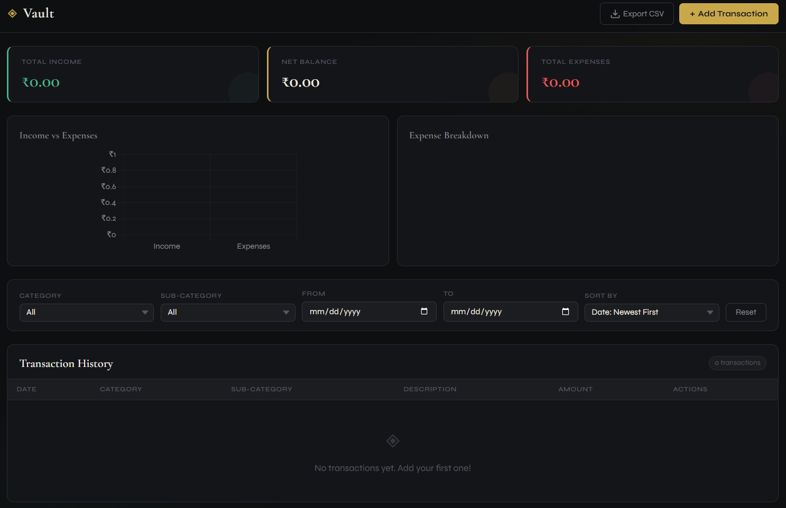
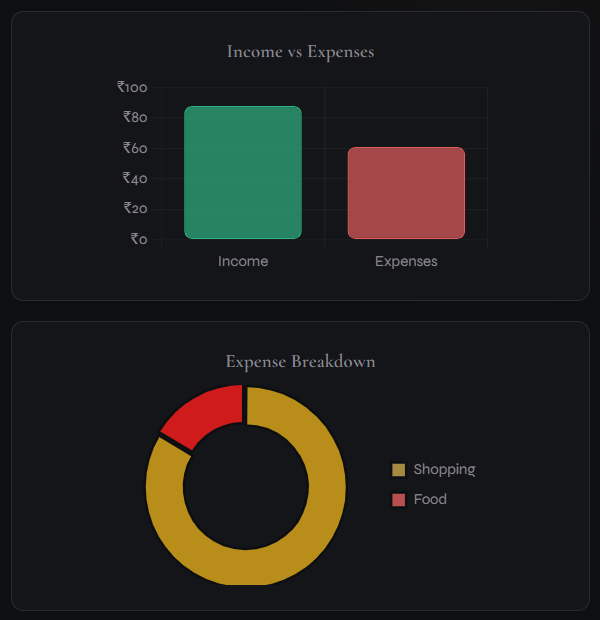

# ◈ Vault 

Vault is a lightweight, serverless personal finance tracker built entirely using standard web technologies (**HTML5, CSS3, and vanilla JavaScript**). Operating completely on the client side, Vault ensures your financial logs remain entirely private, handling and rendering your data right in your browser.

[**Explore the Live Demo »**](https://shlokey755.github.io/Vault/)

---

## 📷 Screenshots

| Dashboard View | Analytics & Charts |
| :---: | :---: |
|  |  |

---

## ✨ Key Features

*   💾 **Persistent Local Storage:** Your budget data stays where it belongs—with you. Vault automatically saves your transaction logs to your browser's `LocalStorage`, meaning your history is preserved across tab closes and page refreshes.
*   ➕ **Quick Transaction Logging:** Seamlessly add daily income and expenses, complete with category selection, dates, amounts, and notes.
*   📊 **Dynamic Data Visualization:** Instantly interpret your financial health through interactive visual charts, helping you identify spending patterns and trends at a glance.
*   📥 **One-Click CSV Export:** Export your entire ledger into a clean `.csv` file format ready to import directly into Excel, Google Sheets, or any other financial tool.
*   ⚡ **Zero Server Overhead:** Completely standalone. No databases, cloud setups, accounts, or complex backend requirements.

---

## 🛠️ Built With

*    — Semantic markup and structure.
*    — Clean, responsive layouts for mobile and desktop screens.
*    — DOM manipulation, state management, calculation logic, and CSV rendering.


---

## 📦 How to Run Locally

Because Vault is built purely with vanilla web languages, you do not need to install complex dependencies or node packages.

### Prerequisites
A modern web browser (Chrome, Firefox, Safari, Edge, etc.)

### Steps

1. **Clone the Repository**
   ```bash
   git clone [https://github.com/shlokey755/Vault.git](https://github.com/shlokey755/Vault.git)
Navigate into the directory

Bash
cd Vault
Launch the Application
Simply double-click the index.html file to open it in your default browser, or serve it using an extension like VS Code's Live Server.

🔒 Privacy & Security
Vault operates on a strict zero-knowledge, offline-first principle:

No analytical tracking or external ad scripts.

No remote database storage; everything stays inside your browser environment.

Clearing your browser cache/cookies for this site will wipe the data, so make sure to use the CSV Export feature to back up your logs regularly!

🤝 Contributing
Contributions are welcome! If you want to enhance Vault, feel free to fork the repository and submit a pull request.

Fork the Project

Create your Feature Branch (git checkout -b feature/AmazingFeature)

Commit your Changes (git commit -m 'Add some AmazingFeature')

Push to the Branch (git push origin feature/AmazingFeature)

Open a Pull Request

📄 License
This project is free for use.

---
